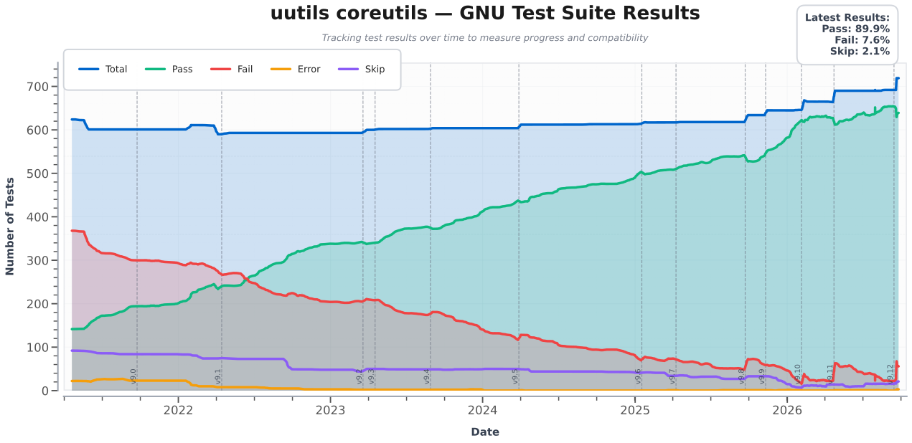
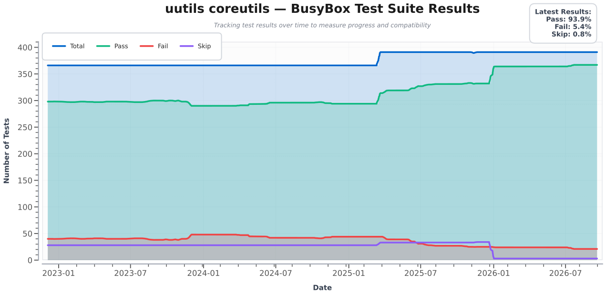
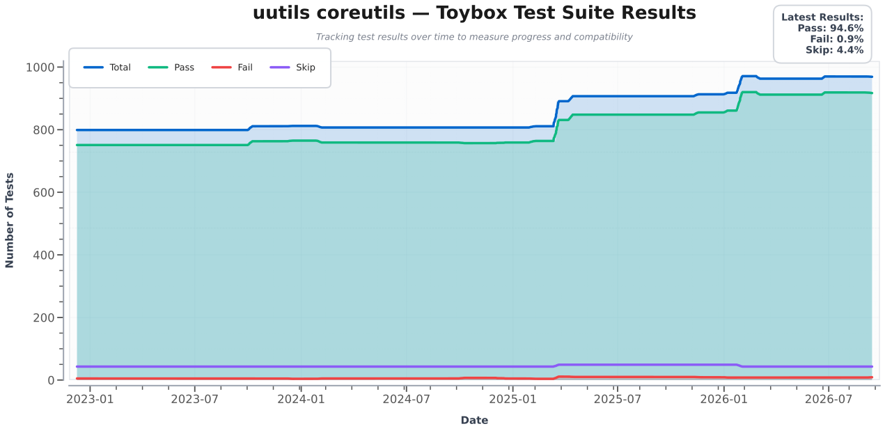
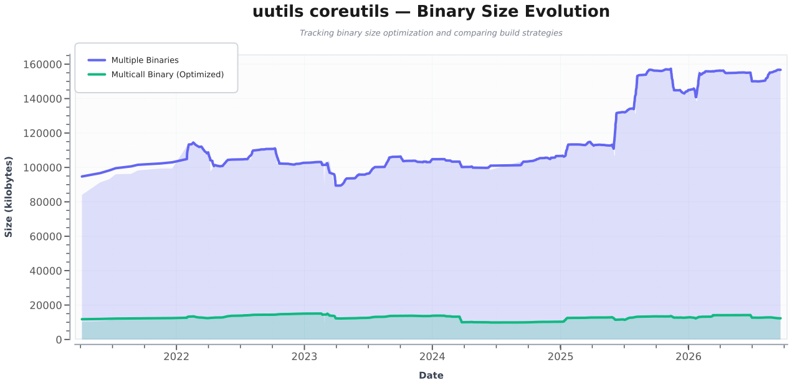
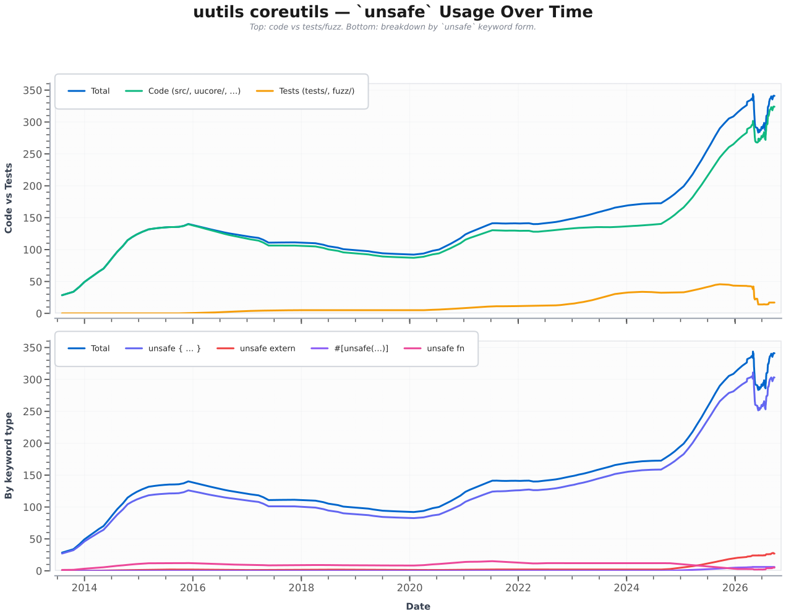
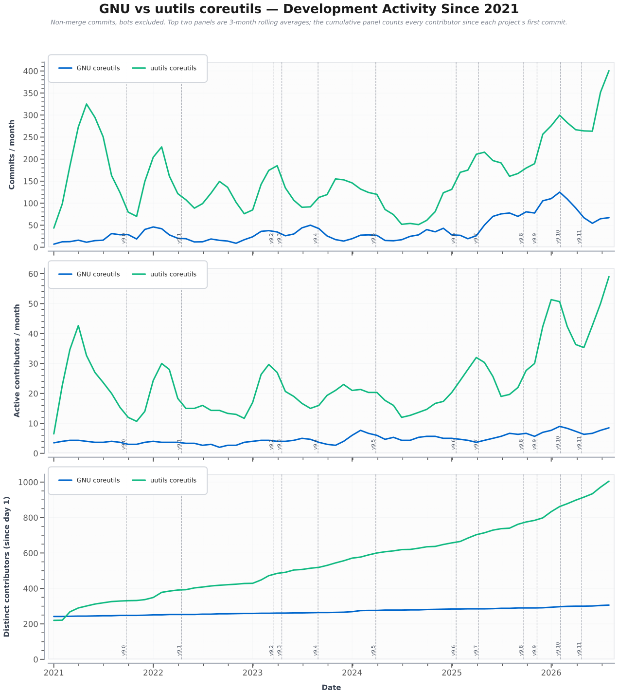

# Various tracking tools for coreutils

Tracking the evolution of https://github.com/uutils/coreutils

## GNU testsuite comparison

Below is the evolution of how many GNU tests uutils passes. A more detailed
breakdown of the GNU test results of the main branch can be found
[in the user manual](https://uutils.github.io/coreutils/docs/test_coverage.html).

Refreshed twice a day by github actions. Changes are documented in the json file ([gnu-result.json](gnu-result.json)).

Compares only the Linux execution.

The percentages leave out the tests that can never pass for structural reasons -
they intercept glibc internals with `LD_PRELOAD` (which never fires, since
Rust's std issues different syscalls), set gdb breakpoints inside GNU's own C
sources, or only run on GNU/Hurd. That list is maintained in the coreutils repo,
in
[util/gnu-unfixable-tests.txt](https://github.com/uutils/coreutils/blob/main/util/gnu-unfixable-tests.txt),
with a reason per entry; tests we could actually fix stay counted on purpose. See
[uutils/coreutils#13841](https://github.com/uutils/coreutils/issues/13841).

Based on:
* https://github.com/uutils/coreutils/blob/main/util/build-gnu.sh
* https://github.com/uutils/coreutils/blob/main/util/run-gnu-test.sh

## Busybox testsuite comparison

Similar results but using the busybox testsuite:
https://github.com/mirror/busybox/tree/master/testsuite

## Toybox testsuite comparison

Similar results but using the toybox testsuite:
https://github.com/landley/toybox/tree/master/tests

## Binary size evolution

Refreshed once a day by github actions.

Compares only the Linux execution.

## `unsafe` usage evolution

Tracks how much `unsafe` Rust the project relies on. The total counts
`unsafe { … }` blocks, `unsafe fn`/`impl`/`trait`/`extern` items and
`#[unsafe(...)]` attributes (Rust 2024) across all `.rs` files outside
`vendor/` and `target/`.

Data lives in [unsafe-result.json](unsafe-result.json). Counting logic is in
`unsafe_count.py`

## Development activity

Monthly commits and contributors for both GNU coreutils and uutils coreutils
since 2021. Non-merge commits only, authors deduplicated via `.mailmap` and
bots (dependabot, renovate, github-actions, …) excluded. The cumulative
contributor panel counts every contributor since each project's first commit,
not just those active since 2021.

Regenerated from both git histories once a day by github actions
([activity-result.json](activity-result.json)).
