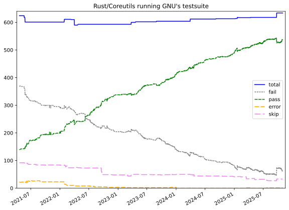
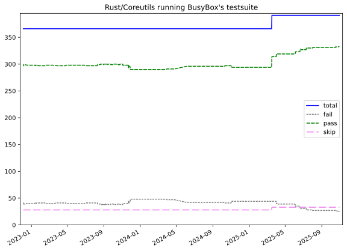
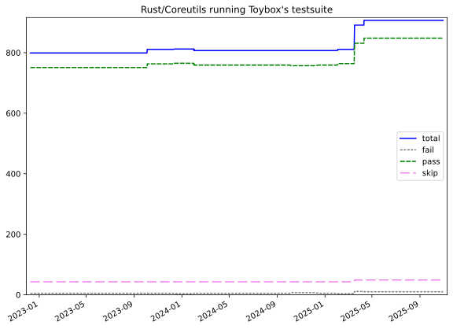
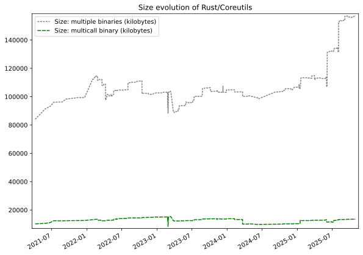

# Various tracking tools for coreutils

Tracking the evolution of https://github.com/uutils/coreutils

## GNU testsuite comparison

Below is the evolution of how many GNU tests uutils passes. A more detailed
breakdown of the GNU test results of the main branch can be found
[in the user manual](https://uutils.github.io/coreutils/docs/test_coverage.html).

Refreshed twice a day by github actions. Changes are documented in the json file ([gnu-result.json](gnu-result.json)).

Compares only the Linux execution.

Based on:
* https://github.com/uutils/coreutils/blob/main/util/build-gnu.sh
* https://github.com/uutils/coreutils/blob/main/util/run-gnu-test.sh

## Busybox testsuite comparison

Similar results but using the busybox testsuite:
https://github.com/mirror/busybox/tree/master/testsuite

## Toybox testsuite comparison

Similar results but using the toybox testsuite:
https://github.com/landley/toybox/tree/master/tests

## Binary size evolution

Refreshed once a day by github actions.

Compares only the Linux execution.
